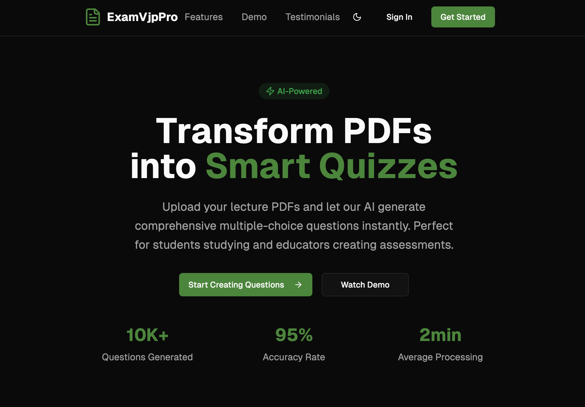

# 🎯 ExamVjpPro - AI-Powered Quiz Generator

[](https://nextjs.org/)
[](https://www.typescriptlang.org/)
[](https://www.convex.dev/)
[](https://tailwindcss.com/)

Transform your PDFs into intelligent quizzes with the power of AI! 🚀



## ✨ What Makes ExamVjpPro Special?

ExamVjpPro is your ultimate study companion that turns any PDF document into comprehensive multiple-choice questions using advanced AI technology. Whether you're a student preparing for exams or an educator creating assessments, we've got you covered!

### 🎉 Key Features

- **🤖 AI-Powered Question Generation**: Upload PDFs and watch as our AI creates thoughtful, relevant questions instantly
- **📊 Smart Analytics**: Track your progress with detailed performance metrics and insights
- **⚡ Lightning Fast**: Generate questions in under 2 minutes on average
- **🎨 Beautiful UI**: Clean, modern interface built with Radix UI and Tailwind CSS
- **🔐 Secure Authentication**: Robust user authentication with Convex Auth
- **📱 Responsive Design**: Perfect experience across all devices
- **🌙 Dark Mode**: Easy on the eyes with full dark mode support
- **📈 Progress Tracking**: Monitor your learning journey with comprehensive attempt history

### 🏆 Impressive Stats

- **10K+** Questions Generated
- **95%** Accuracy Rate
- **2min** Average Processing Time

## 🚀 Getting Started

### Prerequisites

Make sure you have these installed:
- Node.js 18+ 
- pnpm (recommended) or npm
- A Convex account (free to start!)

### Installation

1. **Clone the repository**
   ```bash
   git clone https://github.com/napthedev/examvjppro.git
   cd examvjppro
   ```

2. **Install dependencies**
   ```bash
   pnpm install
   ```

3. **Set up Convex**
   ```bash
   npx convex dev
   ```

4. **Configure authentication**
   ```bash
   npx @convex-dev/auth
   ```

5. **Start the development server**
   ```bash
   pnpm dev
   ```

6. **Open your browser**
   Navigate to `http://localhost:3000` and start creating amazing quizzes! 🎉

### Environment Setup

Create a `.env.local` file in your root directory:

```env
# Convex
CONVEX_DEPLOYMENT=your-deployment-url
NEXT_PUBLIC_CONVEX_URL=your-convex-url

# Authentication (configure based on your providers)
AUTH_SECRET=your-auth-secret
```

## 🛠️ Built With Love Using

### Core Technologies
- **[Next.js 14](https://nextjs.org/)** - The React framework for production
- **[TypeScript](https://www.typescriptlang.org/)** - Type safety and better developer experience
- **[Convex](https://www.convex.dev/)** - Real-time database and backend
- **[Tailwind CSS](https://tailwindcss.com/)** - Utility-first CSS framework

### UI Components & Styling
- **[Radix UI](https://www.radix-ui.com/)** - Unstyled, accessible UI components
- **[Lucide React](https://lucide.dev/)** - Beautiful, customizable icons
- **[Framer Motion](https://www.framer.com/motion/)** - Smooth animations
- **[Sonner](https://sonner.emilkowal.ski/)** - Toast notifications

### AI & Processing
- **[Google Generative AI](https://ai.google.dev/)** - Powerful AI for question generation
- **[js-yaml](https://github.com/nodeca/js-yaml)** - YAML processing
- **[React Dropzone](https://react-dropzone.js.org/)** - File upload handling

### Forms & Validation
- **[React Hook Form](https://react-hook-form.com/)** - Performant forms
- **[Zod](https://zod.dev/)** - Schema validation

## 📁 Project Structure

```
examvjppro/
├── app/                    # Next.js App Router
│   ├── api/               # API routes
│   ├── dashboard/         # Dashboard pages
│   ├── exam/             # Exam-related pages
│   └── signin/           # Authentication
├── components/            # React components
│   ├── ui/               # Reusable UI components
│   ├── landing/          # Landing page components
│   ├── dashboard/        # Dashboard components
│   └── exam/             # Exam components
├── convex/               # Convex backend
│   ├── schema.ts         # Database schema
│   ├── exams.ts          # Exam-related functions
│   └── auth.ts           # Authentication setup
├── hooks/                # Custom React hooks
├── lib/                  # Utility functions
└── public/               # Static assets
```

## 🎯 Core Features Deep Dive

### PDF Processing & AI Generation
Our AI analyzes your PDF content and generates:
- Multiple-choice questions with 4 options each
- Detailed explanations for correct answers
- Difficulty-appropriate content
- Well-structured question formats

### User Dashboard
- Upload and manage your PDFs
- View all generated exams
- Track your progress and scores
- Edit exam names and descriptions

### Exam Taking Experience
- Clean, distraction-free interface
- Timer functionality
- Instant feedback
- Comprehensive result analysis

### Progress Analytics
- Detailed attempt history
- Score tracking over time
- Performance insights
- Improvement recommendations

## 🚀 Deployment

### Vercel (Recommended)

1. **Deploy to Vercel**
   ```bash
   vercel --prod
   ```

2. **Set up Convex for production**
   ```bash
   npx convex deploy --prod
   ```

3. **Configure environment variables** in your Vercel dashboard

For detailed deployment instructions, check out our [Deployment Guide](./docs/VERCEL_DEPLOYMENT_GUIDE.md).

## 🤝 Contributing

We love contributions! Here's how you can help make ExamVjpPro even better:

1. **Fork the repository**
2. **Create a feature branch**: `git checkout -b feature/amazing-feature`
3. **Make your changes** and add tests if applicable
4. **Commit your changes**: `git commit -m 'Add amazing feature'`
5. **Push to the branch**: `git push origin feature/amazing-feature`
6. **Open a Pull Request**

Please read our contributing guidelines and make sure to follow our code of conduct.

## 📝 License

This project is licensed under the MIT License - see the [LICENSE](LICENSE) file for details.

## 🙏 Acknowledgments

- Thanks to the amazing open-source community
- Inspired by the need for better study tools
- Built with passion for education and learning

## 🌟 Star History

If you find ExamVjpPro useful, please consider giving it a star! ⭐

---

<div align="center">

**Made with ❤️ by [NapTheDev](https://github.com/napthedev)**

[🌟 Star this repo](https://github.com/napthedev/examvjppro) • [🐛 Report Bug](https://github.com/napthedev/examvjppro/issues) • [💡 Request Feature](https://github.com/napthedev/examvjppro/issues)

</div>